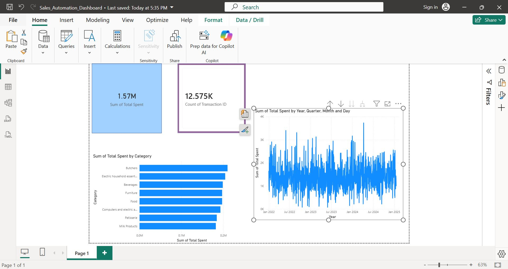

# 📊 Sales Data Pipeline Automation & Analytics

## 🎯 Business Challenge
Organizations handling massive transactional datasets frequently suffer from manual processing bottlenecks, data formatting inconsistencies, and siloed reporting. This project solves a real-world enterprise scenario: engineering an automated pipeline to ingest, sanitize, and structure a high-volume sales dataset (12,000+ rows) to drive reliable corporate decision-making.

## 🛠️ Technical Ecosystem
* **Data Processing & ETL:** Python (Pandas, SQLAlchemy)
* **Database Management:** Microsoft SQL Server (Localhost Instance)
* **Business Intelligence:** Power BI Desktop
* **Version Control:** Git / GitHub

## 🔄 The Data Engineering Workflow
1. **Extraction:** Automated ingestion of localized multi-sheet Excel data sources.
2. **Transformation:** Programmatic data cleaning via Python—handling structural schema checks, missing fields, and data-type normalization.
3. **Loading:** Establishing a secure local server gateway to structurally migrate 12,575 rows into a relational SQL Server target table (`sales_records`).
4. **Visualization:** Connecting Power BI directly to the database layer to build dynamic, interactive executive tracking dashboards.

## 📈 Key Outcomes
* Eliminated manual script executions by introducing a repeatable programmatic pipeline.
* Scaled relational database storage to support seamless, structured data expansions.
* Transformed raw, siloed spreadsheet data into a centralized, refreshable source of truth for corporate leadership.

## 📊 Executive Analytics Interface
Below is the dynamic Power BI dashboard connected directly to the structured SQL Server database instance, transforming the 12,575 sanitized records into actionable business intelligence:

