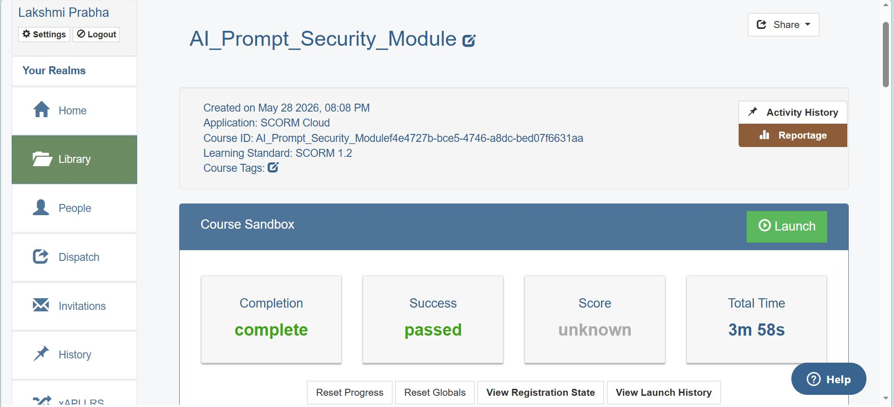
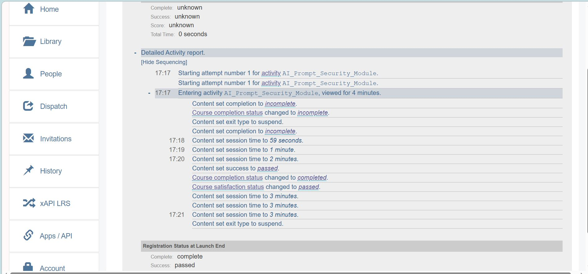

# 📊 Sales Data Pipeline Automation & Analytics

## 👥 The L&D Data Ecosystem (Rise 360 Integration)
This project simulates an enterprise-grade Learning Analytics pipeline. The source dataset represents raw user engagement, module tracking, and assessment scores exported directly from a global **Articulate Rise 360** corporate training deployment. 

Because standard LMS reporting tools often output siloed, unformatted spreadsheets, this pipeline was built to programmatically ingest that raw Rise 360 data, sanitize it via Python, and migrate it to SQL Server for centralized business intelligence reporting.

### 🎬 Project Multi-Media Showcase

▶️ **[Launch Source Rise 360 Course (Live Sandbox Simulation)](https://app.cloud.scorm.com/sc/InvitationConfirmEmail?publicInvitationId=cc0121a0-a20d-4489-a0a1-937f17e19ae8)**

## 🎯 Business Challenge
Organizations handling massive transactional datasets frequently suffer from manual processing bottlenecks, data formatting inconsistencies, and siloed reporting. This project solves a real-world enterprise scenario: engineering an automated pipeline to ingest, sanitize, and structure a high-volume sales dataset (12,000+ rows) to drive reliable corporate decision-making.

## 🛠️ Technical Ecosystem
* **Data Processing & ETL:** Python (Pandas, SQLAlchemy)
* **Database Management:** Microsoft SQL Server (Localhost Instance)
* **Business Intelligence:** Power BI Desktop
* **Version Control:** Git / GitHub

## 🔄 The Data Engineering Workflow
1. **Extraction:** Automated ingestion of localized multi-sheet Excel data sources.
2. **Transformation:** Programmatic data cleaning via Python—handling structural schema checks, missing fields, and data-type normalization.
3. **Loading:** Establishing a secure local server gateway to structurally migrate 12,575 rows into a relational SQL Server target table (`sales_records`).
4. **Visualization:** Connecting Power BI directly to the database layer to build dynamic, interactive executive tracking dashboards.

## 📈 Key Outcomes
* Eliminated manual script executions by introducing a repeatable programmatic pipeline.
* Scaled relational database storage to support seamless, structured data expansions.
* Transformed raw, siloed spreadsheet data into a centralized, refreshable source of truth for corporate leadership.

## 📊 Executive Analytics Interface
Below is the dynamic Power BI dashboard connected directly to the structured SQL Server database instance, transforming the 12,575 sanitized records into actionable business intelligence:

---
## 🧪 LMS Data Origin Verification (SCORM Cloud Audit Logs)
Before processing the raw dataset through Python, the source Articulate Rise 360 package was audited via SCORM Cloud to ensure standard runtime variables (`cmi.core.lesson_status`, `passed`, `completed`) were successfully emitting from the course wrapper to the database:

### 📸 Rise 360 Registration Status

### 💻 Rise 360 LMS Debug Log Communication

